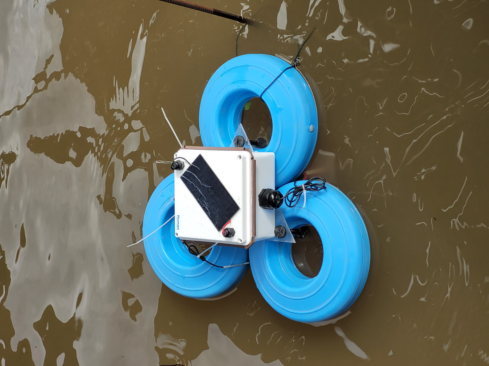
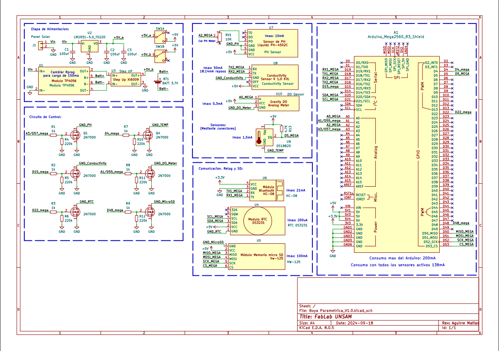

# Water_Quality_Probe-

## Introduction

The development of open-source code and hardware instruments enables both the creation of new technologies and the redesign and adaptation of existing instruments to the user's specific needs. This allows free access to design and operational documentation, creating the possibility for the developed instruments to be replicated, assembled, studied, modified, shared, and collaboratively commercialized by anyone.

The current project involves the design of a low-cost multiparametric water quality probe that enables in situ and remote sensing of physicochemical variables relevant to the environment, such as conductivity, dissolved oxygen, temperature, and pH in bodies of water. The first prototype based on Arduino is already available, and efforts are underway to refine it in order to achieve a more robust, economical, and efficient product. This project proposes integrating the microcontroller into a single printed circuit board (PCB) that facilitates data acquisition and storage over extended periods, reduces energy consumption, and enhances robustness, considering its predominantly outdoor operation.

### Hardware

The monitoring station consists of a sealed waterproof box that floats with the assistance of auxiliary buoys. Inside the box, there is an Arduino Mega microcontroller connected to an external clock, an SD memory module, a low-energy Bluetooth module, a solar-powered energy system, and signal processing and decoupling systems for each sensor. Submersible cables extend from this box to the probes, allowing sampling in the water.

Regarding energy aspects, a solar-powered system was designed. It includes a Li-Ion battery (or two arranged in parallel) that powers the microcontroller and sensors, connected to a 1 Watt solar panel, providing indefinite energy autonomy.

Additionally, it integrates a Bluetooth device using 4.0 BLE (Bluetooth Low Energy) technology. The Serial Bluetooth Terminal® app enables remote control of the probe, such as remote power on/off, selection of measurement intervals, sensor calibration, and data query, curing, and collection. It's worth noting that each measurement includes the exact date and time it was taken. These features make it easy to remotely monitor many relevant variables over extended periods with high sampling rates, allowing for detailed time-series data collection at the study site.

#### Components

* Solar Panel
* Double battery holder
* Arduino Mega 2560 Rev3
* Step Up Power Supply Xl6009 Dc Adjustable Dc 5v 35v 3a Max Arduino
* Lithium Battery Charger Micro USB Module Tp4056 5v
* HC-08 BLE Bluetooth Module
* Micro SD Memory Reader Module: hw-125
* DS3231 RTC Clock
* DS18B20 Submersible Stainless Steel Digital Temperature Sensor
* PH-4502C Liquid PH Sensor with E201-BNC Electrode
* Conductivity Sensor Conductivity K 1.0 Kit (Atlas Scientific)
* Gravity™ Analog Dissolved Oxygen Meter Dissolved Oxygen Sensor (Atlas Scientific)
* 6x 2N7000 N-Channel MOSFETs (low-side power switching, one per module)
* Resistors (1 kΩ gate series, 220 kΩ gate pull-down, 1.7 kΩ OneWire pull-up)

Each sensor and peripheral (pH, conductivity, dissolved oxygen, temperature, RTC and SD card) has
its ground routed through its own 2N7000 MOSFET, so the microcontroller can power each module
independently. Driving the corresponding gate pin `HIGH` closes the low-side switch and powers the
module; `LOW` removes its ground reference and turns it off. Earlier prototypes used an
optocoupled relay module for this; the V1.0 PCB replaced it entirely with MOSFETs.

### Software

The research team is continuosly working on and improving the code. It is written in c++ programming language inside the Arduino IDE as it is the default language for arduino microcontrollers. The system was design to enter sleep mode inside the loop function while the `measurement` option is disabled or in between measurements. It includes an interruption function which is activated once a message is received via Bluetooth. This function wakes the system, executes the corresponding command and once it is finished, it enters the loop again. The different commands include turning on/off the measurement cycle and setting its frequency, sensor calibration, data query and current state information. The updated code is available [here](https://github.com/cepya2022/Water_Quality_Probe-/blob/main/Code_Water_Quality_Probe.ino).

#### Building the firmware

Target board: **Arduino Mega 2560**.

⚠️ **`do_grav.h` is not included in this repository**, so the sketch will not compile from a fresh
clone until the library that provides it is installed. It comes from Atlas Scientific's
**`atlas_gravity`** library (the `Gravity_DO` class used for the dissolved oxygen sensor). That
library is not published to the Arduino Library Manager — download it from Atlas Scientific's
GitHub and copy the `atlas_gravity` folder into your Arduino `libraries/` directory manually.

The following libraries are also required. All except `atlas_gravity` are available through the
Arduino IDE Library Manager:

| Library | Used for |
|---|---|
| `atlas_gravity` | dissolved oxygen sensor (`do_grav.h`) — **manual install, see above** |
| `RTClib` | DS3231 real time clock |
| `Low-Power` | sleep between measurements |
| `DallasTemperature` | DS18B20 temperature sensor |
| `OneWire` | DS18B20 bus |
| `Wire` | I²C (RTC) — bundled with the IDE |
| `SPI` | SD card bus — bundled with the IDE |
| `SD` | SD card — bundled with the IDE |

The conductivity module is driven over `Serial2` with plain text commands, so it needs no library.

Setting the clock: `corregirReloj()` is called from `setup()` but is left commented out. Uncomment
it, upload once while connected to a computer so the RTC picks up the compile-time timestamp, then
comment it out again and re-upload — otherwise the clock is reset to the compile time on every boot.

#### Measurement cycles

Once the measurment is set to `On`, the interface will ask the user to identify the location with an ID (`locationID`) which must be a number. Once it is provided, the arduino will save the `On` state along with the location ID and the current frequency (default is 15 seconds), in a .txt file inside the SD Card. This feature acts as a reassurance in case of a sudden shutdown and restart of the system or any kind of reboot. In this case, during the setup function of the arduino, this file is checked to seek the last state in which the system was operating. In case the measurement was `On`, it sets the frequency and the location ID to their previous states and starts the measurement cycle, otherwise it keeps the default values and enters the loop. The frequency intervals available in the current version are 15 seconds and 1, 5, 15 or 30 minutes. Usually, for outdoor measurements, 30 minutes is a reasonable interval considering battery consumption, solar exposure and a relatively high sampling rate compared to other sampling methods.

During the measurement cycle, the arduino powers each sensor on and off in turn, so that only the module being read draws current at any given moment. First it turns on the pH sensor (`pH`) and waits about 2 seconds for it to settle, then averages 10 consecutive analog samples taken 10 ms apart and converts that average to a pH value using the stored calibration line. Next is the temperature sensor (`T`), which is read once. Third is the conductivity sensor (`EC`), one of the most accurate and precise ones and the slowest per reading, so a single measurement is taken; the value returned by the module is temperature-compensated, which is why it must be read after the temperature. Along with conductivity, the module also returns total dissolved solids (`TDS`). Finally, the dissolved oxygen (`DO`) is read once. Once the parameters are measured, the current date and time are read from the RTC and the record is appended to a .txt file on the SD card as semicolon-separated values, in the order: `date`;`time`;`DO`;`EC`;`TDS`;`pH`;`T`;`locationID`.

> Note: earlier revisions of this document described a 3 minute pH stabilization wait, attributed to
> induction from the relay module, and a 10-reading average for every sensor. Both belong to the
> relay-based prototype and do not describe the current firmware — the V1.0 board has no relays, and
> only pH averages multiple samples. The paragraph above reflects what the code actually does.

#### Data query and state info

There are 3 types of data querys available. The first to refer to the data stored from the measurement cycles. One of them returns the entire information stored in the SD card inside the measurement file, while the other returns only the new information added since the last measurement data query. In case of a shutdown and restart of the system or any kind of reboot, the pointer of the file returns to the first line of the text file, so both queries will return the same information. The third type of data query refers to individual measurements of each sensor taken at real-time. This includes options for each of the 4 sensors and the RTC clock.

The current state information is also a query that returns wether the the measurement mode is On or Off, and the established frequency.

#### Sensor Calibration

The only sensor without the need of a calibration process is the Temperature one, the other three sensors have specific code and procedures for their correct calibrations. 

For the pH sensor, the calibration requires a pH=7 and a pH=4 standard solutions. First, the interface will request the user to use the pH=7 solution and press the `Ok` command when a stable condition is reached. It is recommended to wait at least 3 minutes until it reaches a stable electronic condition in each solution. Then, it will request to do the same in the pH=4 solution. Make sure to wash the probe with distilled water in between solutions. Once both solutions are used, the arduino will give the user the notification that the pH sensor is calibrated and it will save the calibration curve parameters, slope of curve (m) and intercept to the origin (O.o.), in the same file as the Location ID and the measurement state for it to be used in case of a sudden shutdown and restart of the system or any kind of reboot.

